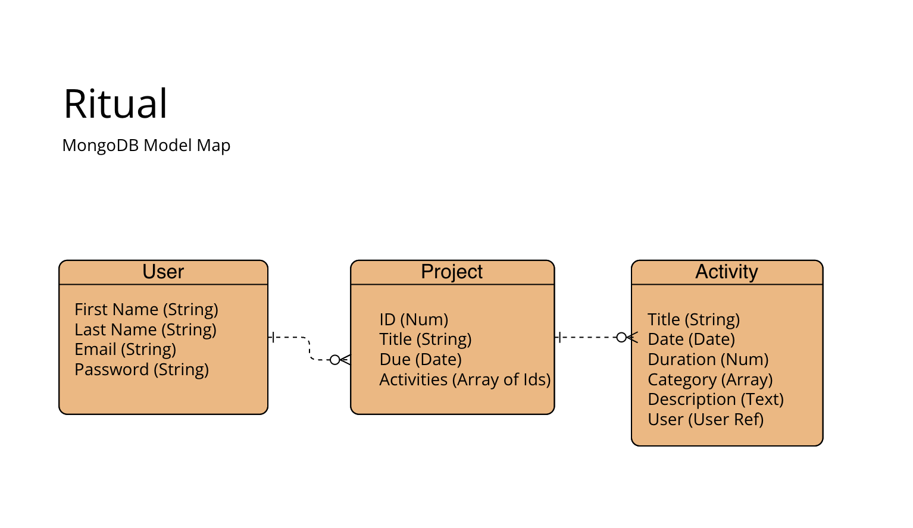

# Ritual

Real progress comes from working on a goal every day. Ritual is a github-like tracker for year-long ambitions.

## Technologies Used
* Javascript
* Express
* Mongodb
* Mongoose
* Nodejs
* Liquidjs
* Bcrypt
* SASS

## User Stories
User will be able to
- Sign up and create a profile
- Add goals to planning, activities you would like to start doing every day
- Be presented with a Github commit log-like representation of their daily activities
- Receive kudos from the app from multi-day streaks

 

 

# Wireframes

 
 

 

 

 

 

 

 

 
 

# ERD

## Models
### User
- First Name (String)
- Last Name (String)
- Email (String)
- Password (String)

### Project
- Title (String)
- Due (Date)
- Events (Array)

### Events
- Title (String)
- Date (Date)
- Category (Array)
- Description (Long Text)
- User association (User Reference)
- Project Association (Project Reference)

## Category
- Title

## Route tables for documents

#### Projects

| **URL**          | **HTTP Verb**|**Action**|
|------------------|--------------|----------|
| /projects/         | GET          | index  
| /projects/:id      | GET          | show       
| /projects/new      | GET          | new   
| /projects          | POST         | create   
| /projects/:id/edit | GET          | edit       
| /projects/:id      | PATCH/PUT    | update    
| /projects/:id      | DELETE       | destroy  