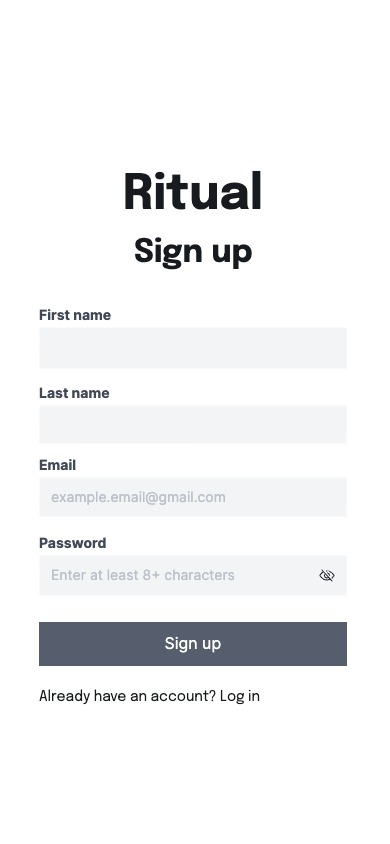
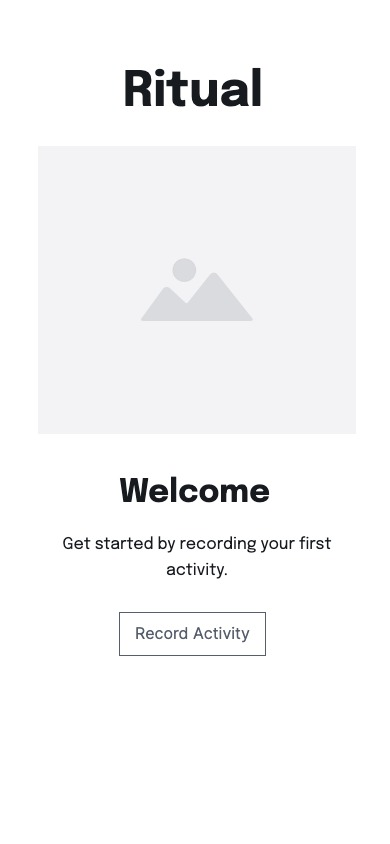
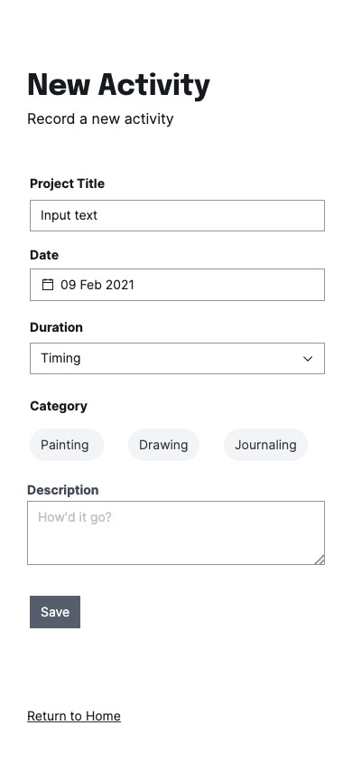
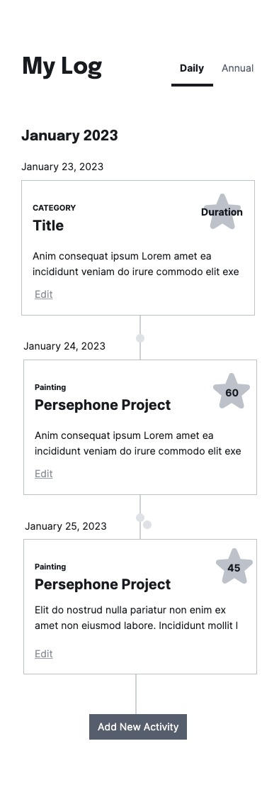
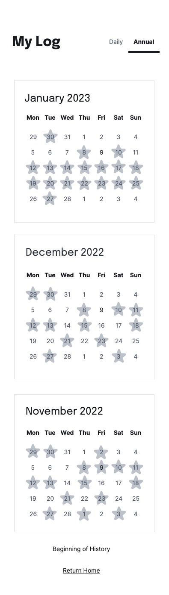

# Ritual | Goal Planning App

Real progress comes from working on a goal every day. Ritual is a github-like tracker for year-long ambitions.

## Technologies Used
* Javascript
* Express
* Mongodb
* Mongoose
* Nodejs
* Liquidjs
* Bcrypt
* SASS

## User Stories
User will be able to
- Sign up and create a profile
- Add goals to planning, activities you would like to start doing every day
- Be presented with a Github commit log-like representation of their daily activities
- Receive kudos from the app from multi-day streaks

## Models
### User
- id (Num)
- Name (String)
- username (String)
- Password (String)

### Goal
- Name (String)
- Log (Object)
- User association

# Projects Goals
- Work with a mobile-first approach
- Demonstrate app goals when user arrives on landing page

## Wireframes

### Welcome

